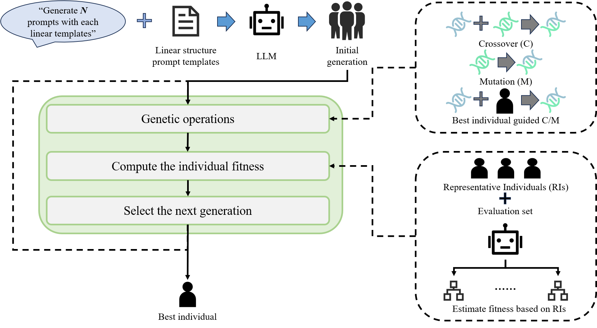
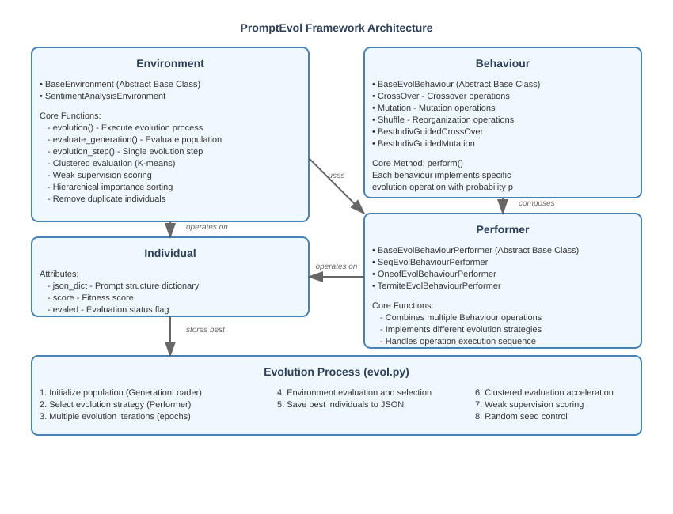

<h1 align="center">
🧬 PromptEvol 🧬
</h1>


<h3 align="center">
A Genetic Programming based Framework for Prompt Engineering
</h3>



- User-friendly usage like popular framework.
- Linearly structured prompt.
- Weak-supervision based fitness for fast evaluation.
- Integrates transformers and MNN for easy and quick using of LLM/MLLM.
- Easily expand to any tasks, which could be evaluated, e.g., recognition, Q&A and multi-label classification etc.

PromptEvol is a Genetic Programming based Framework for Prompt Engineering, which is first designed to obtain a better prompt for LLM/MLLM based task.
This project is a coursework of Adaptive System from University of Sussex (UoS).
 



## 📓Updating Log

- [2025 November] The initial version is created, supporting the sentiment analysis task.

## ⏫Quick Start
Here, you can run the sentiment analysis task as a beginning.
1. Create the virtual environment
```
conda create -n [your_env_name] python=3.12
conda activate [your_env_name]
pip install -r requirements.txt
```
2. Download the [MNN](https://github.com/alibaba/MNN) model and huggingface model files into the corresponding folds from [ModelScope](https://modelscope.cn/collections/Qwen3-MNN-771ce17e78a741) (for main model) and [HuggingFace](https://huggingface.co) (for embedding model), i.e., ```Qwen3-0.6B-MNN```, ```Qwen3-8B-MNN``` and ```Qwen3-0.6B-embedding``` folders.

3. You can directly use the json files in the fold of ``init_prompt``. Or generate the initial generation with linearly sturtured templates ``Role-Task-Format`` as below
```
python prompt_generate.py \ 
--model_path Qwen3-8B-MNN/ \
--template Role-Task-Format \
-n 10
```
About the template, you can design in your person and connect them with ``-``, or let LLM help you to design. If you would like to try on other task, remember to define your task prompt with ``--task_prompt``

4. Start the evolutionary process as follows
```
python evol.py \
--file_path init_prompt \
--max_prompts 7 \
--model_name "Qwen3-0.6B-MNN/" \
--eval_set "dataset/sentiment_analysis.csv" \
--eval_num 8 \
--top_k 35 \
--n_cluster 8 \
--epochs 20 \
--output_dir "evolved_prompt"
```
The best individual will be saved into ```evolved_prompt``` folder.

5. Evalute the best individual on the unseen test set like
```
python eval.py \
--model_path Qwen3-0.6B-MNN/ \
--data_path dataset/sentiment_analysis.csv \
--samples_per_class 50 \
--prompt_file evolved_prompt/evolved_epoch5_top1.json \
--output_file test_results.csv
```

## 🧬More Usages
1. You can implement your evolutionary behaviours as shown in ``performer.py``
```
from PromptEvol.behaviour import BaseEvolBehaviourPerformer, BaseEvolBehaviour, CrossOver, Mutation
from PromptEvol.individual import PromptIndividual
import numpy as np
import random
import re


class Shuffle(BaseEvolBehaviour):
    def __init__(self, p):
        super().__init__(p)
        
    def perform(self, individual):
        child = individual
        if np.random.rand() < self.p:
            json_dict = individual.get_nodes()
            keys = list(json_dict.keys())
            random.shuffle(keys)
            json_dict = {key: json_dict[key] for key in keys}
            child = PromptIndividual(json_dict)
        return child
    

class BestIndivGuidedCrossOver(BaseEvolBehaviour):
    def __init__(self, p):
        super().__init__(p)
        self.crossover = CrossOver(p=p)
        
    def perform(self, indiv, best=None):
        child = indiv
        if best is not None:
            child = self.crossover.perform(indiv, best)
        return child
```

2. You can implement your task environment by inheriting ``PromptEvol.environment.BaseEnvironment``. Note that you must define some abstract methods for loading your own dataset and the evaluation method.
```
class BaseEnvironment(ABC):
    def __init__(self, model_name, eb_performer=None):
        self.llm = self.initialize_model(model_name)
        if eb_performer is None:
            print("Warning: you do not define the evolution behaviour performer, using default BaseEvolBehaviourPerformer...")
        self.eb_performer = eb_performer if eb_performer is not None else BaseEvolBehaviourPerformer()
    
    def initialize_model(self, model_name):
        """Initialize and load the LLM model"""
        print(f"Initializing model from: {model_name}")
        model = llm.create(model_name)
        model.load()
        return model
    
    def evolution(self, generation):
        ...(Other implementations)
        child = self.evolution_step(ind1, ind2)
        ...(Other implementations)
        return new_generation  
    
    
    def evolution_step(self, individual1, individual2):
        child = self.eb_performer(individual1, individual2, self.llm)
        return child

    
    @abstractmethod
    def evaluate_individual(self, individual):
        pass
    
    @abstractmethod
    def evaluate_generation(self, individual):
        pass
    
    @abstractmethod
    def extract_label_from_text(self, text):
        pass
    
    @abstractmethod
    def load_eval_set(self, eval_set, eval_num):
        pass
```

## Citation
```
@misc{promptevol
  title = {PromptEvol: A Genetic Programming based Framework for Prompt Engineering},
  author = {Caibo Feng},
  year = {2025},
}
```
